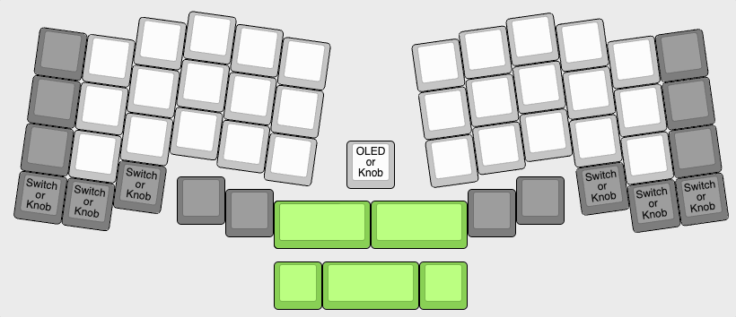
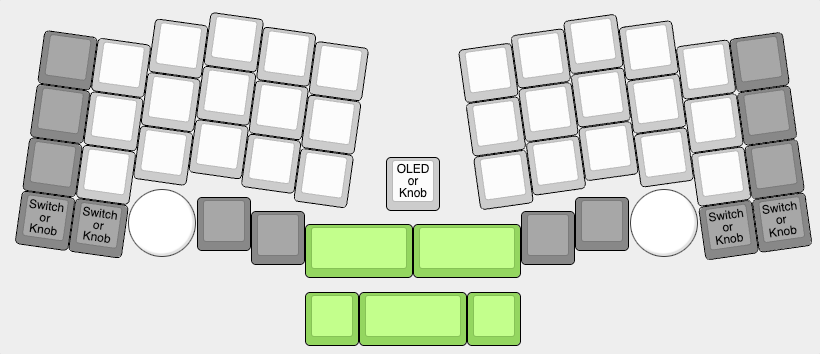

# Scientist Keyboard

A 4x12 DIY ergonomic columnar stagger keyboard PCB that fits 60% cases.

[More pics in the prototype gallery](https://imgur.com/a/xrHWU2O)

[Printable layout tester](../../raw/main/tester/scientist-layout-tester.pdf)

The design is heavily influenced by fantastic projects like Lumberjack, Corne/Cornelius, Rebound, Discipline, Reviung and many more, incorporating many of the ideas in one place (along with a couple of my own). I've been tweaking and refining this layout over several iterations and prototypes both to optimise ergonomics as well as add options and improve support for tray mount cases. It's at the point where it has taken over as my primary keyboard and I'm excited for others to try it out!

## Features

 * Ergonomic columnar stagger
 * Support for many (most?) tray mount 60% cases
 * Aggressive stagger for optimal pinky comfort
 * Corne/Reviung-like thumb key cluster
 * MX Hotswap sockets
 * Knob positions allows for actuation with thumbs without the fingers leaving the home row
 * Mostly through-hole construction for easy DIY construction (see below)
 * Optional RGB Underglow
 * Optional support for up to 3 encoders (up to one each side and one in the centre)
 * Optional support for OLED instead of an encoder in the central position

## Layouts

The PCB layout supports two distinct plates. A universal layout that gives you the most flexibility and supports knobs up to 19mm:

For those who are sure they want to use encoders on each side, there's a dedicated layout that moves the encoders into a better position to allow for the use of knobs up to 27mm in the two outer postions and 19mm in the centre (this is the variant you can see in most of my pictures):

(I'm not planning to make a plate that supports both of these layouts as adding all the necessary holes will be pretty ugly no matter what layout you choose).

## Encoders

Just a quick word about the encoder positioning: I've had lots of questions about whether they get in the way of typing. They don't! I use my thumbs for the inner 6/7 keys on the bottom row, and my pinky for the outer two - this means the knob stays under my palm out of the way, and crucially the knobs can be actuated with my thumbs *without my fingers leaving the home row*. [Here's a video showing the movement](https://imgur.com/a/7S38ULE).

This has been huge for me as it means I've been able to include knob functions in my day to day typing without feeling like they're slowing me down. I highly recommend giving it a try.

## Building

The majority of the components are through-hole and so very easy for the beginner to solder with no special tools. The hotswap sockets *are* surface mount components, but they're very easy to hand solder even for a beginner. Underglow LEDs are a bit more difficult but still possible for most beginners.

The USB socket is the area most beginners are likely to find daunting, it's not hard to solder but does require a bit of care. The job is made *much* easier if you use lots of flux, ideally flux paste, so that is strongly recommended.

More detailed build guide coming!

### Basic build kit

 * PCB
 * Plate
 * 51x Hotswap sockets (depending on configuration)
 * Acrylic cover
 * 8x M2 6mm screws
 * 4x 10mm standoffs
 * ATMega32A flashed with the necessary bootloader
 * 51x diodes
 * 2x 5.1k resistors
 * 2x 75R resistors
 * 1x 1.5k resistor
 * 1x 10k resistor
 * 2x 0.1µF capacitors
 * 2x 22pF capacitors
 * 1x 4.7µF capacitor
 * 1x Fuse
 * 2x 6mm tactile switches
 * 1x 6x2 pin header
 * 1x GCT USB socket
 * 2x Zener diodes
 * 1x 16MHz crystal
 * 1x 40pin chip socket

### Optional components

 * 16x underglow LEDs
 * 128x32 OLED
 * 4x1 OLED socket
 * Up to 3x Encoders and Knobs   

## Case support

The PCB should supports most 60% cases with Poker style tray mount points. It's been tested with Tofu60, Mekanisk Klippe T and Fjell cases and various generic 60% cases. It does *not* support cases with very thick (>5mm) fixed mounting posts in the two central mount point locations without modification, and may require kapton tape insulation (or o-ring mod) for some cases with >4mm mounting posts to prevent shorts. Does not support BBox60 cases without modification due to the many extra mount points present.

## Future plans?

These are all things I've thought about but discounted for this first iteration:

 * Splay on the outer columns
 * Per-key RGB
 * Non through-hole/prebuilt version (once chip prices sort themselves out)
 * Custom case
